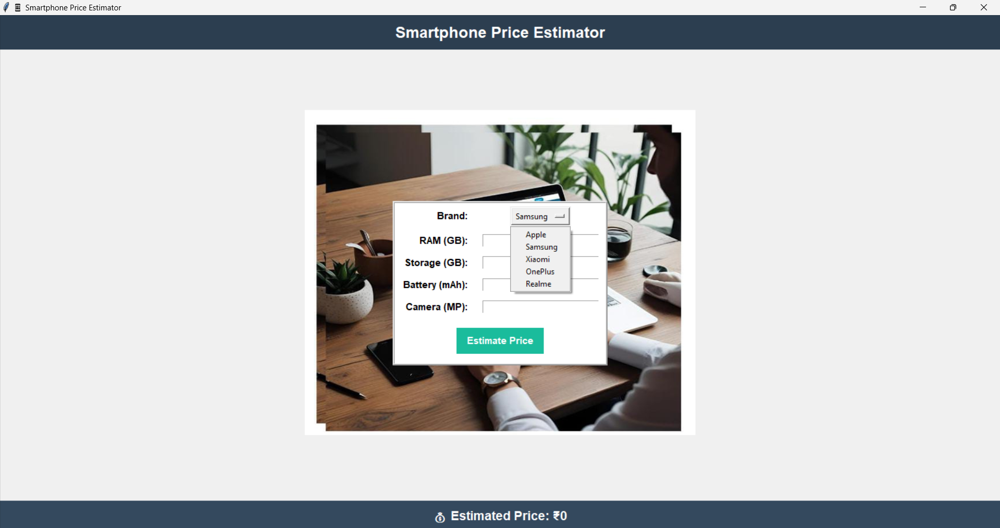

# 📱 Smartphone Price Estimation System

A desktop application built using **Tkinter** and **scikit-learn** that predicts the price of a smartphone based on features like brand, RAM, storage, battery capacity, and camera megapixels.

 

---

## 🚀 Features

* User-friendly GUI built with Tkinter
* Real-time price prediction using a **Linear Regression** model
* Model trained on sample smartphone specifications
* Background image and styled UI elements for better visual experience

---

## 🧠 Technologies Used

* Python 3.x
* Tkinter (for GUI)
* scikit-learn (for model training)
* pandas, numpy (for data handling)
* PIL (Pillow) for image processing
* joblib (for model saving/loading)

---

## 📊 Input Fields

The app takes the following inputs:

* **Brand**: Dropdown menu (Samsung, Apple, Xiaomi, OnePlus, Realme)
* **RAM (GB)**: Integer input
* **Storage (GB)**: Integer input
* **Battery (mAh)**: Integer input
* **Camera (MP)**: Integer input

---

## 🔍 Output

* Displays the estimated price in Indian Rupees (₹), calculated based on the input specifications.

---

## 🛠️ How It Works

1. **Sample Dataset**: A small dataset of 10 smartphones with different specs is used to train a linear regression model.
2. **Model Training**: The features are encoded (Brand → OneHotEncoding) and passed to the `LinearRegression` model.
3. **Prediction**: On user input, the data is converted into a compatible format and passed to the trained model.
4. **UI**: A clean and interactive UI built with Tkinter shows the predicted price.

---

## 📁 Project Structure

```
smartphone_price_estimator/
│
├── bgfile.jpg                 # Background image used in the GUI
├── smartphone_price_model.pkl # Saved machine learning model
├── smartphone_gui.py          # Main Python script
└── README.md                  # Project documentation
```

---

## ▶️ How to Run

1. Make sure Python is installed on your system.
2. Install required libraries:

   ```bash
   pip install pandas numpy scikit-learn pillow
   ```
3. Place a background image and rename it to `bgfile.jpg` or update the path in code.
4. Run the script:

   ```bash
   python smartphone_gui.py
   ```

---

## 📷 Screenshot

<!-- You can include an actual screenshot if available -->

> 

---

## 📌 Notes

* This app uses a **very small dataset** for demonstration. For real-world use, train the model on a larger and more diverse dataset.
* You can improve the model by using more advanced algorithms or adding more features (e.g., processor type, screen size).

---

## 📧 Contact

For any queries or suggestions, feel free to connect:

**Shreedevi Rampur**
📧 [shreedevirampur794@gmail.com](mailto:shreedevirampur794@gmail.com)
🌐 [GitHub](https://github.com/Shreedevi17-bc)

---

